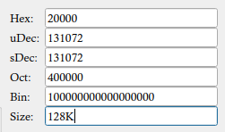

# Regviewer

## 简介

一个查看、修改寄存器各个位的小工具，初衷是想写一个简单的位查看工具，希望它占桌面空间小，支持置顶功能。后续又添加了计算和寄存器域显示等功能。
大多数功能工作良好，但是有一些不常用的场景仍然有BUG，没有花时间去修复，相关bug列在最后。

程序启动后默认界面大概是这个样子：


在保存变量，显示寄存器信息之后，界面占用会明显变大：


## 支持特性

* 支持windows和linux系统
* 任意连续bit的置1，清0，取反
* 2、8、10、16进制显示
* 8、16、32、64位宽模式
* 三种移位模式：逻辑、算术、循环
* 表达式计算，变量存储
* Armv8寄存器分域显示
* Byte数到地址Size的转换

## 编译运行

使用Qt Creator环境编写，可以下载后，使用Qt Creator打开RegViewer.pro文件直接编译。

程序运行需要使用data目录下的文件，包括字体、寄存器信息等。可以把这些文件复制到编译的输出跑径，否则因为找不到文件报错hh。

## User Guide

### Bit范围操作

这个模块允许对指定范围内的Bits进行操作。其中，bit的范围是不区分位置的，比如要对8至15bit进行操作，输入`8-15`或`15-8`都是可以的。


提取功能：提取当前值中指定的Bits，x=x[end:start]

### 移位功能：Shift


支持3种移位方式：逻辑移位、算术移位和循环移位，通过右侧列表框进行选择。

### 表达式计算：Calculator

表达式计算功能基于[Cparse](https://github.com/cparse/cparse)实现，支持以下运算符，所有运算符优先级与C语言相同：

- 算术：+, -, /, *, %,**（乘方）
- 移位： <<, >>
- 位运算：^,&,|
- 逻辑：<, >, <=, >=, ==, !=, &&, ||

在cparse的基础上，添加了位运算，支持16进制（需以'0x'开头）数字的运算。


变量使用：

* 'x'代表当前显示变量
* 使用"`变量名=表达式`"的形式进行赋值

> 此功能内部使用long long int进行计算，目前只支持64bit模式，在其它模式下部分功能有问题

#### 示例: 使用变量

采用赋值的形式可以直接将数值存在变量里，之后可以使用变量名代替数值进行计算。为'x'变量赋值时，"x="可以省略。比如：

```
pc=0x80000000     // store 0x80000000 at 'pc'
offset=0x400	 // store 0x400 at 'offset'
pc+offset		// set x = pc + offset
```

当光标在Calculator输入框，并且存在变量时，会显示所有的变量，此时点击”clear“按钮可以清除所有变量。


#### 示例：计算offset

kernel的链接文件vmlinux.lds中包含大量OFFSET表达式，比如:

```
idmap_pg_dir = .;
. += ((((((48)) - 4) / (12 - 3)) - 1) * (1 << 12));
```

可以直接把`((((((48)) - 4) / (12 - 3)) - 1) * (1 << 12))`粘到Calculator中计算结果，并从Size文本框直接读出Size的大小。


### 寄存器域显示

用于显示ARMv8的寄存器各个域。

对于显示不全的域，可以在其域名上悬停鼠标，得到完整的描述。


> 寄存器相关信息保存在软件目录下的data/reg_data_armv8.json文件中，可以按照需求增加、修改。

##不同格式的数据显示



目前支持2、8、10、16进制和地址Size的格式显示，每一种格式都可以直接修改。

其中，Size显示功能用于快速转换Byte数和对应的Memory大小。

#Bug List

* bit范围设置没有对输入的有效性进行检测

* 非64bit模式下，Calculator出现问题，比如`-1<<2*(2-3)`

* linux下置顶复选框无效，一般linux下在窗口右击都有置顶的选项


#To Do List

* 寄存器名自动补全
* 地址范围格式美化
* Set Value更名
